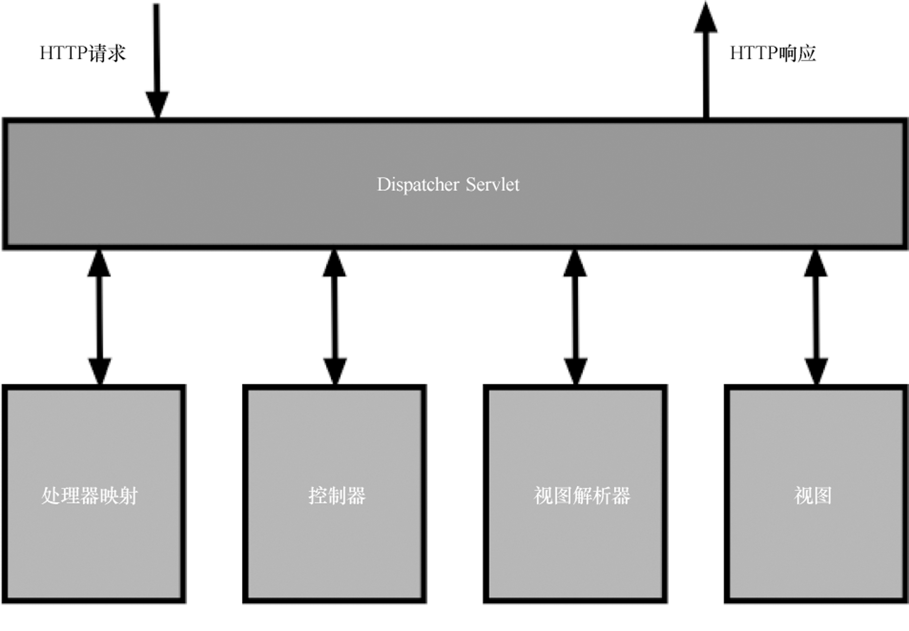

# MVC构架
* Model 模型：包含了应用中所需的各种展现数据
* view 视图：由数据的多种表述所组成，它将会展现给用户。
* Controller 控制器：将会处理用户的操作，它是连接模型和视图的桥梁。

# 领域驱动设计
Eric Evans在《Domain-DrivenDesign》（DDD：领域驱动设计）中有一条核心的理念就是将面向对象的范式应用到领域对象之中。如果违背这一原则的话，就被称之为贫血领域模型（Anemic Domain Model）。  

贫血模型通常有如下症状：
* 模型是由简单老式的Java对象（plain old Java object,POJO）构成，只有getter和setter方法；
* 所有业务逻辑都是在服务层处理；
* 对模型的校验会在本模型外部进行，例如在控制器中。

避免领域贫血的途径如下：
* 服务层适合进行应用级别的抽象（如事务处理），而不是业务逻辑；
* 领域对象应该始终处于合法的状态。通过[校验器（validator）](#)或JSR-303的校验注解，让校验过程在表单对象中进行；
* 将输入转换成有意义的领域对象；
* 将数据层按照Repository的方式，Repository中会包含领域查询；
* 将领域逻辑与底层的持久化框架解耦；
* 尽可能使用实际的对象，例如操作FirstName类而不是操作String。

# Spring MVC架构
## 1、DispatcherServlet
每个Spring Web应用的入口都是DispatcherServlet。



1. 将HTTP请求分发给HandlerMapping，HandlerMapping将URL与控制器关联；
2. 通过@RequestMapping对应控制器的对应方法被调用，并返回视图名称；
3. DispatcherServlet查询ViewResolver接口，得到对应视图的实现。
4. 最后视图被渲染，其结果会写入到响应中。

>controller返回的字符串上添加"redirect:"或"forward:"会触发到特定的URL导航，也就是再次发送请求访问controller，而不是直接返回页面。

## dispatcher-servlet.xml

1. 配置静态资源，css、js等；
><mvc:resources mapping="/static/\**" location="static/"/>

2. 启用spring MVC注释

# 解决springMVC的中文乱码问题
## 1、页面编码
```xml
<%@ page contentType="text/html;charset=UTF-8" language="java" %>
```

## 2、URL中的乱码（爱用不用）
修改tomcat的server.xml中的Connector  
默认为：
```xml
<Connector port="8080" protocol="HTTP/1.1" connectionTimeout="20000" redirectPort="8443" />
```
改为：
```xml
<Connector port="8080" protocol="HTTP/1.1" connectionTimeout="20000" redirectPort="8443" URIEncoding="utf-8"/>
```

## 3、配置过滤器
使用spring的字符集过滤器**CharacterEncodingFilter**，在web.xml中配置：
```xml
<filter>
		<filter-name>CharacterEncodingFilter</filter-name>
		<filter-class>org.springframework.web.filter.CharacterEncodingFilter</filter-class>

		<init-param>
				<param-name>encoding</param-name>
				<param-value>utf-8</param-value>
		</init-param>
</filter>

<filter-mapping>
		<filter-name>CharacterEncodingFilter</filter-name>
		<url-pattern>/*</url-pattern>
</filter-mapping>
```
>注意：字符集过滤器需要配置在所有过滤器之前！！！
## 4、数据库编码
>"jdbc:mysql://127.0.0.1:3306/mvcdb?useUnicode=true&characterEncoding=UTF-8"

# 校验
通过JSR-303规范校验，所需jar包包括：javax.validation和hibernate.validator。
```xml
<dependency>
		<groupId>javax.validation</groupId>
		<artifactId>validation-api</artifactId>
		<version>2.0.1.Final</version>
</dependency>
<dependency>
		<groupId>org.hibernate.validator</groupId>
		<artifactId>hibernate-validator</artifactId>
		<version>6.0.10.Final</version>
</dependency>
```

# Spring MVC 控制层
Spring MVC的控制层是通过使用@Controller注解来进行处理的。在Web应用中，控制器的角色是响应HTTP请求。带有@Controller注解的类将会被Spring检索到，并且能够有机会处理传入的请求。  
通过使用@RequestMapping注解，控制器能够声明它们会根据HTTP方法和URL来处理特定的请求。  
通常控制器会返回视图名称，通过视图解析器跳转到指定的页面。若要将具体内容作为返回值，需要使用@ResponseBody注解或@RestController注解。


<style>
.box{
  display:flex;
  justify-content:space-around
}
</style>
