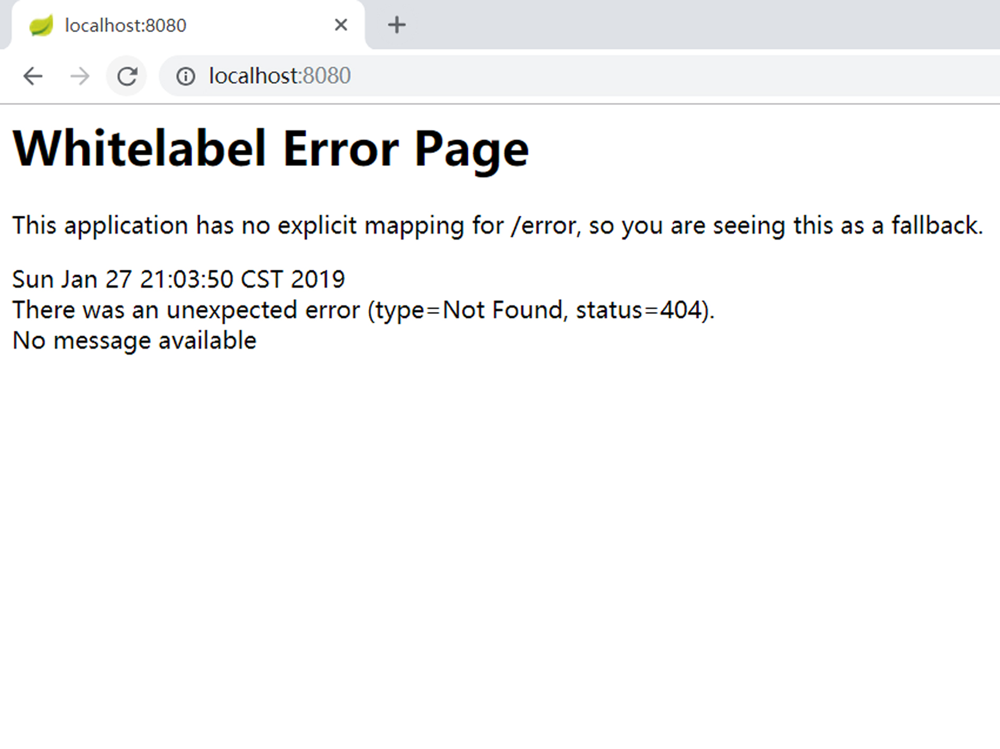

# 搭建SpringMVC项目的步骤：
1. 初始化SpringMVC的DispatcherServlet；
2. 搭建转码过滤器，保证客户端请求进行正确的转码；
3. 搭建视图解析器（view resolver），告诉Spring去哪里查找视图，以及它们是使用哪种方言编写的（JSP、Thymeleaf模版等）；
4. 配置静态资源的位置（CSS、JS）；
5. 配置所支持的地域以及资源bundle；
6. 配置multipart解析器，保证文件上传能够正常工作；
7. 将Tomcat或Jetty包含进来，从而能够在Web服务器上运行我们的应用；
8. 建立错误页面（如404）。

## 1、分发器配置

`DispatcherServletAutoConfiguration`是一个典型的Spring Boot配置类。  
* 与其他Spring配置类相同，使用了@Configuration注解；
* 一般会通过@Order（`@AutoConfigureOrder(Ordered.HIGHEST_PRECEDENCE)`）注解来生命优先等级，可以看到DispatcherServletAutoConfiguration需要优先进行配置;
* 其中也可以包含一些提示信息，如`@AutoConfigureAfter(ServletWebServerFactoryAutoConfiguration.class)`或@AutoconfigureBefore，从而进一步细化配置处理的顺序；
* 它还支持在特定的条件下启用某项功能。通过使用`@ConditionalOnClass(DispatcherServlet.class)`这个特殊的配置，能够保证我们的类路径下包含DispatcherServlet，这能够很好地表明Spring MVC位于类路径中，用户当前希望将其启动起来。
* 其中还包含SpringMvc分发器Servlet和multipart解析器的典型配置。

```java
@Bean(name = DEFAULT_DISPATCHER_SERVLET_REGISTRATION_BEAN_NAME)
@ConditionalOnBean(value = DispatcherServlet.class, name = DEFAULT_DISPATCHER_SERVLET_BEAN_NAME)
public DispatcherServletRegistrationBean dispatcherServletRegistration(
		DispatcherServlet dispatcherServlet) {
	DispatcherServletRegistrationBean registration = new DispatcherServletRegistrationBean(
			dispatcherServlet, this.webMvcProperties.getServlet().getPath());
	registration.setName(DEFAULT_DISPATCHER_SERVLET_BEAN_NAME);
	registration.setLoadOnStartup(
			this.webMvcProperties.getServlet().getLoadOnStartup());
	if (this.multipartConfig != null) {
		registration.setMultipartConfig(this.multipartConfig);
	}
	return registration;
}
```
>dispatcherServelt的默认配置，`registration.setName`等同于`<servlet-name></servlet-name>`，`registration.setLoadOnStartup`等用于`<load-on-startup></load-on-startup>`，`DispatcherServletRegistrationBean registration = new DispatcherServletRegistrationBean(dispatcherServlet, this.webMvcProperties.getServlet().getPath())`设置路径`<url-pattern></url-pattern>`，也可以通过`registration.addUrlMapping`设置路径。

>如果需要配置多个dispatcherServlet需要自己来写DispatcherServletRegistrationBean方法，需要注意的是，`registration.setName`时，name相同的DispatcherServletRegistrationBean只有一个生效，后注册的会覆盖掉之前的。

## 2、转码配置
`HttpEncodingAutoConfiguration`文件中包含转码相关配置，可以通过`spring.http.encoding.charset`配置

## 3、视图解析器配置
`WebMvcAutoConfiguration`中包含了视图解析器、地域解析器（localeresolver）以及静态资源的位置

```java
@Bean
@ConditionalOnMissingBean
public InternalResourceViewResolver defaultViewResolver() {
	InternalResourceViewResolver resolver = new InternalResourceViewResolver();
	resolver.setPrefix(this.mvcProperties.getView().getPrefix());
	resolver.setSuffix(this.mvcProperties.getView().getSuffix());
	return resolver;
}
```

>在配置文件中通过`spring.mvc.view.prefix`和`spring.mvc.view.suffix`进行配置

## 4、静态资源位置配置
`WebMvcAutoConfiguration`中包含了视图解析器、地域解析器（localeresolver）以及静态资源的位置

```java
public class ResourceProperties {

	private static final String[] CLASSPATH_RESOURCE_LOCATIONS = {
			"classpath:/META-INF/resources/", "classpath:/resources/",
			"classpath:/static/", "classpath:/public/" };

	/**
	 * Locations of static resources. Defaults to classpath:[/META-INF/resources/,
	 * /resources/, /static/, /public/].
	 */
	private String[] staticLocations = CLASSPATH_RESOURCE_LOCATIONS;

}
```

可以看出，默认的静态资源位置为：
* "classpath:/META-INF/resources/"
* "classpath:/resources/"
* "classpath:/static/"
* "classpath:/public/"

## 5、地域解析器配置
```java
@Bean
@ConditionalOnMissingBean
@ConditionalOnProperty(prefix = "spring.mvc", name = "locale")
public LocaleResolver localeResolver() {
	if (this.mvcProperties
			.getLocaleResolver() == WebMvcProperties.LocaleResolver.FIXED) {
		return new FixedLocaleResolver(this.mvcProperties.getLocale());
	}
	AcceptHeaderLocaleResolver localeResolver = new AcceptHeaderLocaleResolver();
	localeResolver.setDefaultLocale(this.mvcProperties.getLocale());
	return localeResolver;
}
```
通过spring.mvc.local属性配置

## 6、Multipart解析器配置

```java
@ConfigurationProperties(prefix = "spring.servlet.multipart", ignoreUnknownFields = false)
public class MultipartProperties {

	/**
	 * Whether to enable support of multipart uploads.
	 */
	private boolean enabled = true;

	/**
	 * Intermediate location of uploaded files.
	 */
	private String location;

	/**
	 * Max file size.
	 */
	private DataSize maxFileSize = DataSize.ofMegabytes(1);

	/**
	 * Max request size.
	 */
	private DataSize maxRequestSize = DataSize.ofMegabytes(10);

	/**
	 * Threshold after which files are written to disk.
	 */
	private DataSize fileSizeThreshold = DataSize.ofBytes(0);

	/**
	 * Whether to resolve the multipart request lazily at the time of file or parameter
	 * access.
	 */
	private boolean resolveLazily = false;
}
```

>使用spring.servlet.multipart.（注释）属性配置对应属性

## 7、Servlet容器配置

```java
@ConfigurationProperties(prefix = "server", ignoreUnknownFields = true)
public class ServerProperties {

	/**
	 * Server HTTP port.
	 */
	private Integer port;

	/**
	 * Network address to which the server should bind.
	 */
	private InetAddress address;
  ...
}
```
>server.()属性配置


## 错误配置
`ErrorMvcAutoConfiguration`文件中保存错误页面配置，如“Whitelabel Error Page”如果需要将whitelabel错误页面设置为无效，需要在配置文件application.properties中将`error.whitelabel.enabled`设置为false。  
<div class="box">
  <div style="width:400px">
    
    <p align="center">显示Whitelabel</p>
  </div>
  <div style="width:400px">
    
    <p align="center">不显示Whitelabel</p>
  </div>
</div>

# MVC构架
* Model 模型：包含了应用中所需的各种展现数据
* view 视图：由数据的多种表述所组成，它将会展现给用户。
* Controller 控制器：将会处理用户的操作，它是连接模型和视图的桥梁。

<style>
.box{
  display:flex;
  justify-content:space-around
}
</style>
