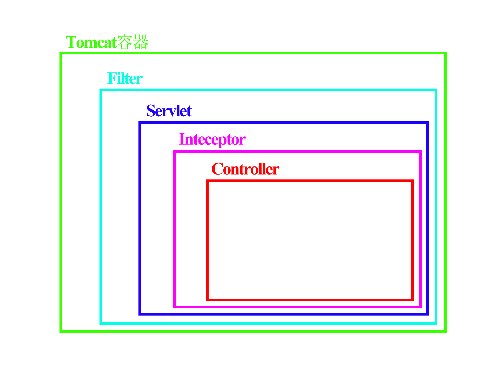
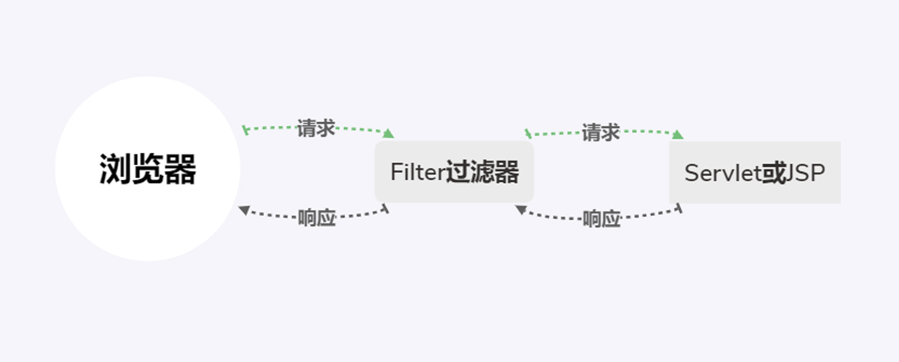

# 拦截器和过滤器的区别
1. 拦截器是基于java的反射机制的，而过滤器是基于函数回调。
2. 拦截器不依赖与Servlet容器，而过滤器依赖于Servlet容器。
3. 拦截器只能对action请求起作用，而过滤器则可以对几乎所有的请求起作用。
4. 拦截器可以访问action上下文、值栈里的对象，而过滤器不能访问。
5. 在action的生命周期中，拦截器可以多次被调用，而过滤器只能在容器初始化时被自动实例化。
6. **拦截器可以获取IOC容器中的各个bean，而过滤器不行。**



# 拦截器和过滤器的触发
## 过滤器的触发
过滤器的触发时机在进入容器后，Servlet前，所以过滤器的doFilter(ServletRequest request, ServletResponse response, FilterChain chain)的入参是ServletRequest，而不是HttpServletRequest。  

```java
@Override
public void doFilter(ServletRequest request, ServletResponse response, FilterChain chain) throws IOException, ServletException {
    System.out.println("before...");
    chain.doFilter(request, response);
    System.out.println("after...");
}
```
运行结果：
>before...  
===Controller===  
after...  
before...  
after...

调用Servlet的doService()方法是在chain.doFilter()方法中进行的。  



## 拦截器的触发
```java

```

>preHandle()是在过滤器的chain.doFilter()的前一步执行，也就是在`System.out.println("before...");`和`chain.doFilter(request, response);`之间。


# 过滤器的配置方法
## 1、使用@WebFilter注解
```java
@Component
@WebFilter(urlPatterns = "/*",filterName = "loginFilter")
public class LoginFilter implements Filter {
    @Override
    public void doFilter(ServletRequest request, ServletResponse response, FilterChain chain) throws IOException, ServletException {
        System.out.println("before...");
        chain.doFilter(request, response);
        System.out.println("after...");
    }
}
```

## 2、使用@Bean注解
```java
@Configuration
public class FilterConfig {
    @Bean
    public FilterRegistrationBean loginFilterRegistration(){
        FilterRegistrationBean registration=new FilterRegistrationBean();
        registration.setFilter(new LoginFilter());
        registration.addUrlPatterns("/*");
        registration.setName("LoginFilter");
        registration.setOrder(1);
        return registration;
    }

    @Bean
    public FilterRegistrationBean loginFilterRegistration2(){
        FilterRegistrationBean registration=new FilterRegistrationBean();
        registration.setFilter(new LoginFilter());
        registration.addUrlPatterns("/login");
        registration.setName("LoginFilter2");
        registration.setOrder(2);
        return registration;
    }
}
```

>使用@Bean注解的方式可以通过setOrder来控制执行顺序。数字越小，优先级越高。  
>使用@WebFilter注解配置的过滤器高于@Bean注解配置的过滤器。
