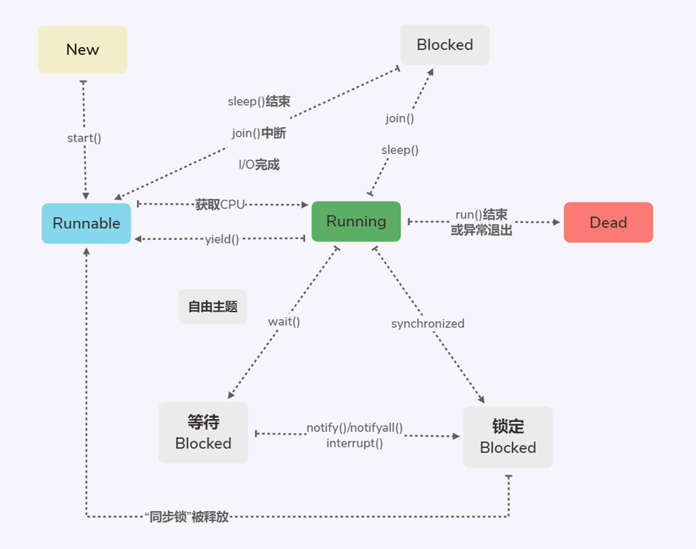

# 线程的状态


1. **新建状态**：线程被创建后进入新建状态，如：Thread thread=new Thread()。
2. **可执行状态**：触发start()方法后进入可执行状态，争夺CPU资源；
3. **执行状态**：线程获得CPU资源后进入执行状态；只能从可执行状态进入可执行状态。
4. **死亡状态**：run()方法执行结束，或异常退出。该线程生命周期结束。
5. **阻塞状态**：分为三种
  * 等待阻塞--调用wait()方法，进入阻塞状态，**释放锁**。
  * 同步阻塞--在获取synchronized同步锁时失败（锁被占用），进入阻塞状态。
  * 其他阻塞--调用join()或sleep()方法或者发出I/O请求，进入阻塞状态。

# 线程状态间的转换
## wait()和sleep()的区别
调用wait()和sleep()都会使线程进入阻塞状态，区别在于：
1. wait()会释放锁，而sleep()不会。
2. 调用wait()进入阻塞状态的线程，可以通过notify()/notifyall()来唤醒，或指定时间。
3. 调用sleep()进入阻塞状态的现象，会指定时间（毫秒），时间结束后进入可执行状态。

## wait()、notify()、notifyall()的使用
wait()、notify()、notifyall()定义在Object中，因为需要对“同步锁”进行操作，通过锁对象来调用。
notify()唤醒等待该锁的一个线程，如果有多个等待线程，就随机唤醒一个。
notifyall()唤醒所有等待该锁的一个线程。

## yield() 让步
让当前线程退出执行状态，进入可执行状态，但不保证会是其他相同优先级的线程获取CPU资源。因为让步的线程进入可执行状态，也会参与争夺CPU资源，所以也有可能再次获得CPU资源。
>yield()让步的线程不会释放锁，如果有锁则其他线程无法获取CPU资源

# 多线程控制类
## ThreadLocal类

**作用：** 保存线程的独立变量。  
常用于用户登录控制，如记录session信息。
**实现：** 每个Thread都持有一个ThreadLocalMap类型的变量。

## 原子类
如果使用atomic wrapper class和atomicInteger，或者使用自己保证原子性的操作，则等同于synchronized。
compareAndSet可用于实现乐观锁（CAS）
```java
AtomicInteger atomicInteger=new AtomicInteger();
atomicInteger.compareAndSet(oldValue,newValue);
```
