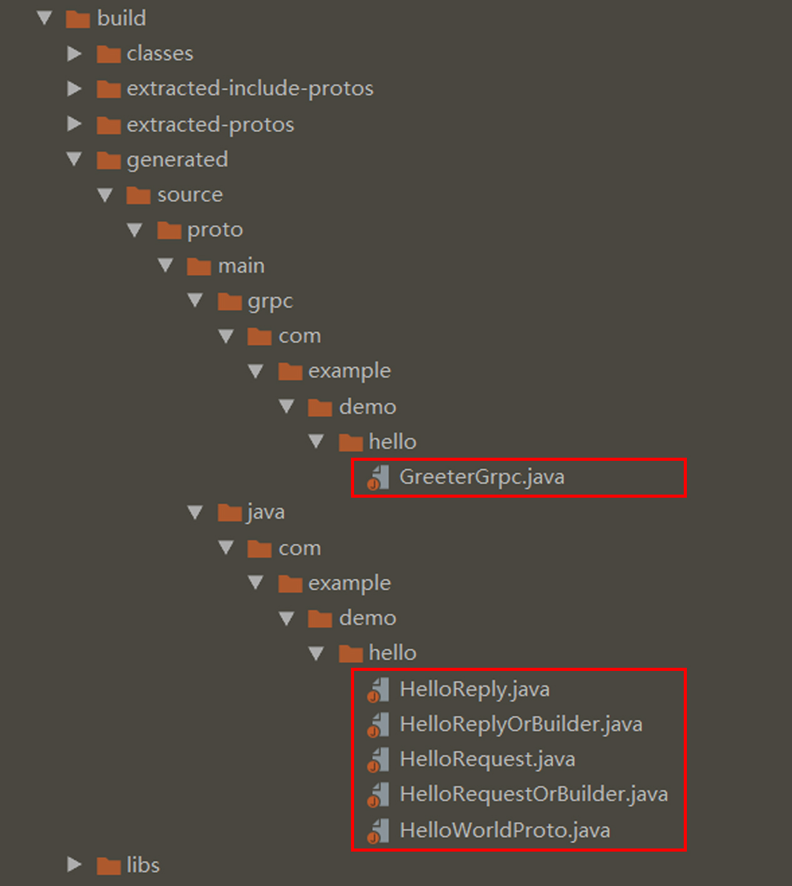

[gRPC官方文档中文版](http://doc.oschina.net/grpc)  
[gRPC Docs](https://grpc.io/docs/)

# gRPC简介
gRPC是一个现代的开源高性能RPC框架，可以在任何环境中运行。它可以有效地连接数据中心内和跨数据中心的服务，并提供可插拔的支持，以实现负载平衡，跟踪，健康检查和身份验证。它还适用于分布式计算的最后一英里，用于将设备，移动应用程序和浏览器连接到后端服务。

主要使用场景：
* 在微服务式架构中有效地连接多语言服务
* 将移动设备，浏览器客户端连接到后端服务
* 生成高效的客户端库

核心功能，使其很棒：
* 10种语言的惯用客户端库
* 高效的线缆和简单的服务定义框架
* 基于 http/2 的传输的双向流
* 可插拔的身份验证，跟踪，负载平衡和健康检查

# protocol buffers简介
gRPC 默认使用 protocol buffers，这是 Google 开源的一套成熟的结构数据序列化机制（当然也可以使用其他数据格式如 JSON）。正如你将在下方例子里所看到的，你用 proto files 创建 gRPC 服务，用 protocol buffers 消息类型来定义方法参数和返回类型。

# 代码
## 1、helloword.proto文件
```
syntax = "proto3";

option java_multiple_files = true; // 是否拆分类文件
option java_package = "com.example.demo.hello"; // 生成的文件所在的包
option java_outer_classname = "HelloWorldProto"; // 输出类主文件(此配置可选)

// 定义一个服务
service Greeter {
    rpc SayHello (HelloRequest) returns (HelloReply) {}
}

// 请求体定义
message HelloRequest {
    string name = 1;
}
// 响应体定义
message HelloReply {
    string massage = 1;
}
```

## 2、build.gradle
```
buildscript {
    ext {
        springBootVersion = '2.1.2.RELEASE'
    }
    repositories {
        mavenCentral()
    }
    dependencies {
        classpath("org.springframework.boot:spring-boot-gradle-plugin:${springBootVersion}")
        classpath("com.google.protobuf:protobuf-gradle-plugin:0.8.5")
    }
}

apply plugin: 'java'
apply plugin: 'org.springframework.boot'
apply plugin: 'io.spring.dependency-management'
apply plugin: 'com.google.protobuf'

group = 'com.example'
version = '0.0.1-SNAPSHOT'
sourceCompatibility = '11'

repositories {
    mavenCentral()
}

def grpcVersion='1.18.0'
def protobufVersion='3.6.1'
def protocVersion=protobufVersion

dependencies {
    // gRPC
    implementation 'io.grpc:grpc-okhttp:1.18.0'
    implementation "io.grpc:grpc-protobuf:${grpcVersion}"
    implementation "io.grpc:grpc-stub:${grpcVersion}"
    implementation "com.google.protobuf:protobuf-java-util:${protobufVersion}"
    runtimeOnly "io.grpc:grpc-netty-shaded:${grpcVersion}"

    implementation 'org.springframework.boot:spring-boot-starter-data-redis'
    implementation 'org.springframework.boot:spring-boot-starter-web'
    implementation 'org.mybatis.spring.boot:mybatis-spring-boot-starter:1.1.1'
    implementation 'org.springframework.boot:spring-boot-starter-thymeleaf'
    implementation 'org.webjars:materializecss:1.0.0'
    implementation 'org.webjars:jquery:3.3.1'
    runtimeOnly 'mysql:mysql-connector-java'
    testImplementation 'org.springframework.boot:spring-boot-starter-test'
}

protobuf {
    protoc {
        artifact = "com.google.protobuf:protoc:${protobufVersion}"
    }
    plugins {
        grpc {
            artifact = "io.grpc:protoc-gen-grpc-java:${grpcVersion}"
        }
    }
    generateProtoTasks {
        all()*.plugins {
            grpc {}
        }
    }
}
```

进行编译
>gradle build



将生成的java文件复制到目标包中。

## 3、服务端 HelloServer.java
```java
package com.example.demo.hello;

import io.grpc.Server;
import io.grpc.ServerBuilder;
import io.grpc.stub.StreamObserver;

import java.io.IOException;
import java.util.logging.Logger;


public class HelloServer {
    private static final Logger logger=Logger.getLogger(HelloServer.class.getName());
    private Server server;
    private void start() throws IOException {
        int port=50051;
        server= ServerBuilder.forPort(port).addService(new GreeterImpl()).build().start();
        logger.info("Server started, listening on "+port);
        Runtime.getRuntime().addShutdownHook(new Thread(){
            public void run(){
                System.err.println("*** shutting down gRPC server since JVM is shutting down");
                HelloServer.this.stop();
                System.err.println("*** server shut down");
            }
        });
    }

    private void stop(){
        if (server!=null){
            server.shutdown();
        }
    }

    private void blockUntilShutdown() throws InterruptedException {
        if (server!=null){
            server.awaitTermination();
        }
    }

    public static void main(String[] args) throws InterruptedException, IOException {
            final HelloServer server=new HelloServer();
            server.start();
            server.blockUntilShutdown();
        }

    private class GreeterImpl extends GreeterGrpc.GreeterImplBase{
        public void sayHello(HelloRequest request,
                             StreamObserver<HelloReply> responseObserver) {
        HelloReply reply =HelloReply.newBuilder().setMassage("Hello "+request.getName()).build();
        responseObserver.onNext(reply);
        responseObserver.onCompleted();
        }

    }
}
```

## 4、客户端 HelloClient.java
```java
package com.example.demo.hello;

import io.grpc.ManagedChannel;
import io.grpc.ManagedChannelBuilder;
import io.grpc.StatusRuntimeException;

import java.util.concurrent.TimeUnit;
import java.util.logging.Level;
import java.util.logging.Logger;

public class HelloClient {
    private static final Logger logger = Logger.getLogger(HelloClient.class.getName());
    private final ManagedChannel channel;
    private final GreeterGrpc.GreeterBlockingStub blockingStub;

    public HelloClient(String host, int port) {
        this(ManagedChannelBuilder.forAddress(host,port).usePlaintext().build());
    }


    public HelloClient(ManagedChannel channel) {
        this.channel=channel;
        blockingStub= GreeterGrpc.newBlockingStub(channel);
    }

    public void shutdown() throws InterruptedException {
        channel.shutdown().awaitTermination(5, TimeUnit.SECONDS);
    }

    public void greet(String name){
        logger.info("Will try to greet "+name+"...");
        HelloRequest request= HelloRequest.newBuilder().setName(name).build();
        HelloReply response;
        try {
            response=blockingStub.sayHello(request);
        }catch (StatusRuntimeException e){
            logger.log(Level.WARNING,"RPC failed:{0}",e.getStatus());
            return;
        }
        logger.info("Greeting: "+response.getMassage());

    }

    public static void main(String[] args) throws InterruptedException {
            HelloClient client=new HelloClient("localhost",50051);
            try {
                String user="Lan";
                if (args.length>0){
                    user=args[0];
                }
                client.greet(user);
            }finally {
                client.shutdown();
            }
        }
}
```
